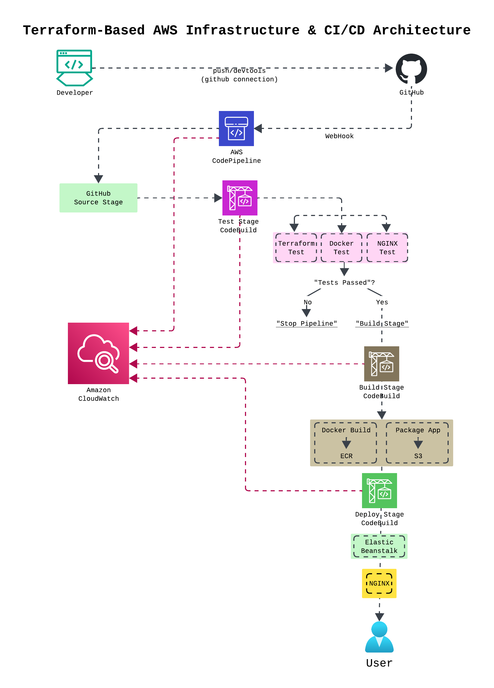

# AWS Terraform CI/CD Project

## Project Overview

This project demonstrates an AWS cloud infrastructure and CI/CD pipeline built with Terraform.
The infrastructure is deployed as code and the application is automatically tested, built, containerized, pushed to Amazon ECR, and deployed to an AWS Elastic Beanstalk environment.

The goal of this project is to demonstrate a practical Infrastructure as Code (IaC), containerization, and CI/CD workflow on AWS.

---

## Architecture



---

## CI/CD Workflow

The pipeline follows this workflow:

1. Developer pushes code to the `main` branch.
2. GitHub triggers AWS CodePipeline.
3. CodePipeline retrieves the source code.
4. **Test stage** runs validation and Terraform tests.
5. **Build stage** builds the Docker image.
6. The Docker image is pushed to **Amazon ECR**.
7. **Deploy stage** creates an Elastic Beanstalk application version.
8. Elastic Beanstalk deploys the application.
9. The updated application becomes available through the Elastic Beanstalk environment URL.

---

## AWS Services Used

| AWS Service                | Purpose                                     |
| -------------------------- | ------------------------------------------- |
| **Amazon VPC**             | Network infrastructure                      |
| **Amazon EC2**             | Compute resources used by Elastic Beanstalk |
| **Elastic Beanstalk**      | Application deployment platform             |
| **Amazon ECR**             | Docker container image registry             |
| **AWS CodePipeline**       | CI/CD orchestration                         |
| **AWS CodeBuild**          | Test, build, and deployment automation      |
| **Amazon S3**              | Pipeline artifacts                          |
| **AWS IAM**                | Roles and permissions                       |
| **AWS CloudFormation**     | Infrastructure used by Elastic Beanstalk    |
| **Amazon CloudWatch Logs** | Application and deployment logging          |
| **GitHub**                 | Source-code repository                      |
| **Terraform**              | Infrastructure as Code                      |

---

## Project Structure

```text
aws-terraform-beanstalk-cicd-project/

├── README.md
├── application
│   ├── Dockerfile
│   └── index.html
├── architecture
│   └── aws-terraform-cicd-architecture.png
├── buildspec-build.yml
├── buildspec-deploy.yml
├── buildspec-test.yml
└── terraform
    ├── codebuild_projects.tf
    ├── codepipeline.tf
    ├── data.tf
    ├── ecr.tf
    ├── elasticbeanstalk.tf
    ├── github_connection.tf
    ├── iam_beanstalk.tf
    ├── iam_build.tf
    ├── iam_codepipeline.tf
    ├── iam_deploy.tf
    ├── iam_test.tf
    ├── networking.tf
    ├── output.tf
    ├── private_subnet.tf
    ├── provider.tf
    ├── public_subnet.tf
    ├── s3.tf
    ├── security_groups.tf
    ├── terraform.tfstate
    ├── terraform.tfstate.backup
    ├── terraform.tfvars
    ├── tfplan
    └── variables.tf
```---

## Infrastructure as Code

Terraform is used to provision and manage the AWS infrastructure.

Typical Terraform workflow:

```bash
terraform init
terraform format -recursive
terraform validate
terraform plan
terraform apply
```

To remove the infrastructure:

```bash
terraform destroy
```

---

## Docker

The application is packaged as a Docker container using NGINX.

Example Dockerfile:

```dockerfile
FROM nginx:alpine

COPY index.html /usr/share/nginx/html/index.html

EXPOSE 80
```

The Docker image is built during the CI/CD pipeline and pushed to Amazon ECR.

---

## Build Stages

### 1. Test

The test stage validates the Terraform configuration and performs basic project checks.

```text
GitHub
   │
   ▼
CodePipeline
   │
   ▼
CodeBuild
   │
   ├── Terraform Init
   ├── Terraform Validate
   └── Project Tests
```

### 2. Build

The build stage creates the Docker image and pushes it to Amazon ECR.

```text
Application Source
        │
        ▼
    Docker Build
        │
        ▼
   Docker Image
        │
        ▼
     Amazon ECR
```

### 3. Deploy

The deployment stage creates an Elastic Beanstalk application version and deploys it to the target environment.

```text
CodeBuild
    │
    ▼
S3 Deployment Artifact
    │
    ▼
Elastic Beanstalk
    │
    ▼
Application Environment
```

---

## Security

The project uses AWS IAM roles and policies to control access between AWS services.

Examples include permissions for:

* CodePipeline
* CodeBuild
* Elastic Beanstalk
* Amazon ECR
* Amazon S3
* CloudFormation
* CloudWatch Logs

The project is designed to follow the **principle of least privilege** wherever practical.

### Security Best Practices

* Do not commit AWS access keys.
* Do not commit secrets or passwords.
* Use IAM roles instead of long-term credentials where possible.
* Restrict IAM permissions to required resources and actions.
* Keep Terraform state protected.

---

## Networking

The infrastructure uses an Amazon VPC with public subnets for Application Load Balancer (ALB) and private subnets where EC2 instances resides for more controled environment.

A typical production-style architecture is:

```text
                    Internet
                       │
                       ▼
                ┌─────────────┐
                │ Internet    │
                │ Gateway     │
                └──────┬──────┘
                       │
                ┌─────────────┐
                │ Application |
                |LOad Balancer│
                └──────┬──────┘            
                       |
                 Public Subnet
                       │
                ┌──────▼──────┐
                │     NAT     │
                │   Gateway   │
                └──────┬──────┘
                       │
                Private Subnet
                       │
                ┌──────▼──────┐
                │ Application │
                │   Servers   │
                └─────────────┘
```

Private application resources can use a NAT Gateway for outbound internet access when required.

---

## Amazon ECR

The Docker image is stored in an Amazon ECR repository.

Example:

```text
nginx-app-repo
```

The CI/CD pipeline performs:

```text
Docker Build
     │
     ▼
Docker Tag
     │
     ▼
ECR Login
     │
     ▼
Docker Push
     │
     ▼
Amazon ECR
```

---

## Elastic Beanstalk

The application is deployed to an AWS Elastic Beanstalk environment.

Example resources:

```text
Application:
nginx-app-terraform

Environment:
nginx-app-production-env
```

Elastic Beanstalk manages the underlying application infrastructure while the CI/CD pipeline handles application delivery.

---

## Environment Variables

The deployment process can use environment variables such as:

```text
AWS_REGION
EB_APPLICATION_NAME
EB_ENVIRONMENT_NAME
CODEPIPELINE_ARTIFACT_BUCKET
```

These values should be configured appropriately for each environment.

---

## Local Testing

Before pushing changes, validate the Terraform configuration:

```bash
terraform fmt
terraform validate
terraform plan
```

For Docker:

```bash
docker build -t nginx-app .
docker run -p 8080:80 nginx-app
```

Then open:

```text
http://localhost:8080
```

---

## Deployment

After infrastructure has been created, deployment is triggered by pushing code to GitHub:

```bash
git add .
git commit -m "Update application"
git push origin main
```

The pipeline then automatically performs:

```text
Git Push
   ↓
GitHub
   ↓
CodePipeline
   ↓
Test
   ↓
Build
   ↓
Amazon ECR
   ↓
Deploy
   ↓
Elastic Beanstalk
```

---

## CI/CD Benefits

This architecture provides:

* ✅ Automated testing
* ✅ Automated Docker builds
* ✅ Automated deployments
* ✅ Infrastructure as Code
* ✅ Version-controlled infrastructure
* ✅ Repeatable deployments
* ✅ Centralized CI/CD pipeline
* ✅ Containerized application
* ✅ AWS-native deployment workflow

---

## Cost Considerations

This project is designed as a **learning/MVP architecture**, but AWS resources can still generate charges.

Potential cost-generating resources include:

* NAT Gateway
* Elastic Load Balancer
* EC2 instances
* Elastic Beanstalk resources
* CodeBuild
* S3
* ECR
* CloudWatch Logs
* Public IPv4 addresses

For development and learning environments, unused resources should be destroyed when they are no longer needed:

```bash
terraform destroy
```

---

## Cleanup

To remove Terraform-managed infrastructure:

```bash
terraform destroy
```

Verify that any manually created AWS resources are also removed if they are not managed by Terraform.

---

## Future Improvements

Possible improvements include:

* [ ] Add HTTPS using ACM
* [ ] Add Route 53 DNS
* [ ] Add AWS WAF
* [ ] Add CloudFront
* [ ] Add automated security scanning
* [ ] Add Terraform remote state using S3
* [ ] Add state locking
* [ ] Add separate development, staging, and production environments
* [ ] Add automated rollback
* [ ] Add CloudWatch alarms
* [ ] Add blue/green deployments
* [ ] Migrate application deployment to ECS Fargate
* [ ] Implement stronger IAM least-privilege policies
* [ ] Add vulnerability scanning for Docker images

---

## Project Goals

The primary goals of this project are to demonstrate practical experience with:

### **Infrastructure as Code**

```text
Terraform
    ↓
AWS Infrastructure
```

### **Containerization**

```text
Application
    ↓
Docker
    ↓
Amazon ECR
```

### **Continuous Integration / Continuous Deployment**

```text
GitHub
   ↓
CodePipeline
   ↓
CodeBuild
   ↓
ECR
   ↓
Elastic Beanstalk
```

---

## Author

### **Charlton Cagigas**

AWS Solutions Architect Professional

This project was created to demonstrate AWS cloud architecture, Terraform Infrastructure as Code, Docker containerization, and automated CI/CD deployment.

---

## Project Summary

> **GitHub → CodePipeline → CodeBuild → Amazon ECR → Elastic Beanstalk**

The infrastructure is managed using **Terraform**, while the CI/CD pipeline automates application testing, container image creation, and deployment to AWS.

---
